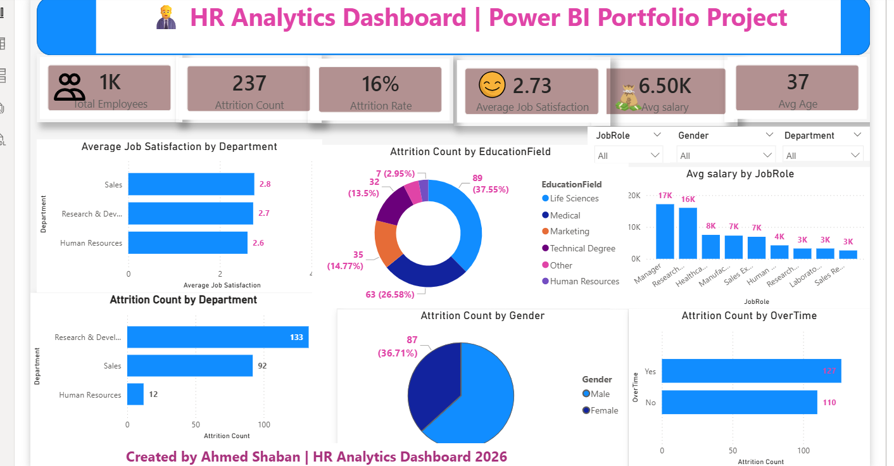

# 👨‍💼 HR Analytics Dashboard | Power BI

## Project Overview

This dashboard analyzes employee attrition, demographics, job roles, and workforce performance.

## KPIs

- Total Employees: 1K
- Attrition Count: 237
- Attrition Rate: 16%
- Average Job Satisfaction: 2.73
- Average Salary: 6.50K
- Average Age: 37

## Tools Used

- Power BI
- Power Query
- DAX

## Key Insights

- Employee attrition rate reached 16%.
- Research & Development has the highest employee count.
- Managers receive the highest average salary.
- Life Sciences is the most common education field.
- Average job satisfaction score is 2.73.n

## Files

- - HR Analytics Dashboard.pbix
- Dashboard Screenshot

## Dashboard Preview

