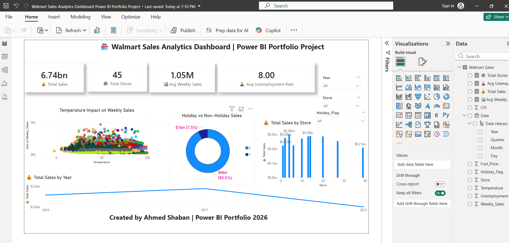

# 📊 Walmart Sales Analytics Dashboard | Power BI

## Project Overview
This Power BI dashboard analyzes Walmart sales performance across 45 stores between 2010 and 2012.

## Dashboard Preview

## Key Insights
- Total Sales: $6.23 Billion
- Total Stores: 45
- Average Weekly Sales: $1.04 Million
- Average Unemployment Rate: 7.99
- Non-Holiday sales contributed 92.5% of total sales.
- Sales peaked in 2011.
- Store 20 achieved the highest sales performance.

## Tools Used
- Power BI
- Power Query
- DAX
- Data Modeling

## Visualizations
- KPI Cards
- Scatter Plot
- Donut Chart
- Bar Chart
- Line Chart
- Interactive Slicers
