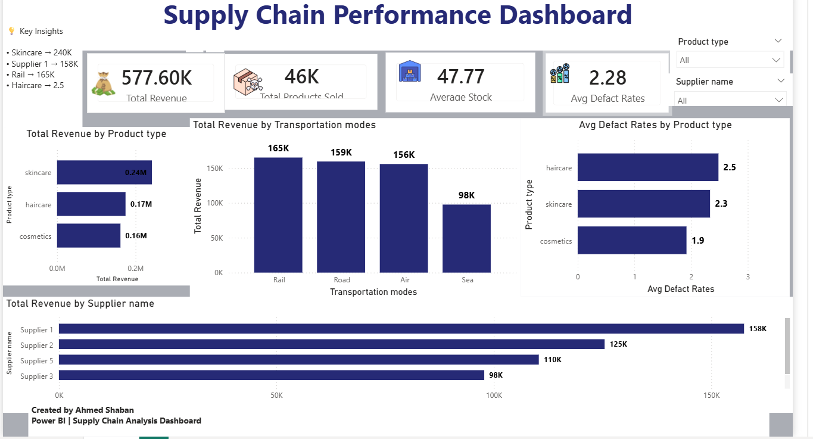

# 🚚 Supply Chain Performance Dashboard | Power BI

## Project Overview

This Power BI dashboard analyzes supply chain performance across products, suppliers, and transportation modes.

## KPIs

- Total Revenue: 577.60K
- Total Products Sold: 46K
- Average Stock: 47.77
- Average Defect Rate: 2.28

## Dashboard Preview

## Dashboard Preview

## Tools Used

- Power BI
- DAX
- Data Modeling
- Data Visualization
.
